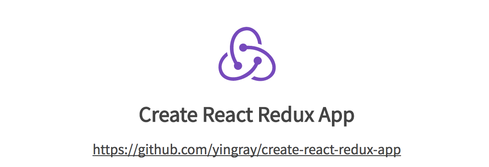
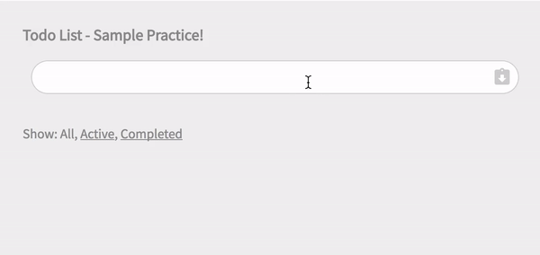
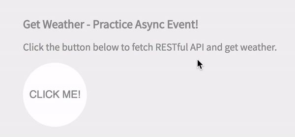

[](https://yingray.github.io/create-react-redux-app/)

[](https://travis-ci.org/yingray/create-react-redux-app)
[](https://coveralls.io/github/yingray/create-react-redux-app?branch=master)

# We will have the new structure for REDUX soon! (Sep. 2017)

This project was bootstrapped with Create React App and Redux Structure.

Todo List (Redux):



API (fetch):




## Dependencies

* React
    * react
    * react-dom

* Create React App
    * react-scripts

* Redux
    * redux
    * react-redux
    * react-router
    * react-router-redux
    * redux-thunk
    
* Fetch
    * babel-polyfill
    * isomorphic-fetch

* Github Deployment Tool
    * gh-pages

## Getting Started

### Installation

To create a new react-redux app, run:

```sh
git clone https://github.com/yingray/create-react-redux-app.git ~/create-react-redux-app
cd ~/create-react-redux-app
npm install
```

It will create a directory called **create-react-redux-app** inside the current folder.
Inside that directory, it will generate the initial project structure and install the transitive dependencies:

```
create-react-redux-app/
  src/
    actions/
        index.js
    components/
        HomePage.js
        Card.js
        TodoFooter.js
        Link.js
        Todo.js
        TodoList.js
    constants/
        ActionTypes.js
    containers/
        AddTodo.js
        HomePage.js
        FilterLink.js
        VisibleTodoList.js
    images/
        logo.svg
    reducers/
        index.js
        todos.js
        visibilityFilter.js
    styles/
        App.css
        index.css
    index.js
  test/
    App.spec.js
    
  --
  README.md
  node_modules/
  package.json
  .gitignore
  public/
    favicon.ico
    index.html
```

### Runs the app in development mode:

```
npm start
```

Open http://localhost:3000 to view it in the browser.

### Runs the test watcher in an interactive mode:

```
npm test
```

By default, runs tests related to files changes since the last commit.

### Builds the app for production to the build folder:

```
npm run build
```

It correctly bundles React in production mode and optimizes the build for the best performance.
The build is minified and the filenames include the hashes.
Your app is ready to be deployed!

Reference: https://github.com/facebookincubator/create-react-app

### Deploys the production to github.io page:

Changes package.json
 
```
"homepage": "http://{account_name}.github.io/{project_name}",
```

And runs

```
npm run build
npm run deploy
```

## MIT License

Copyright (c) 2016 Ying-Ray Lu

Permission is hereby granted, free of charge, to any person obtaining a copy
of this software and associated documentation files (the "Software"), to deal
in the Software without restriction, including without limitation the rights
to use, copy, modify, merge, publish, distribute, sublicense, and/or sell
copies of the Software, and to permit persons to whom the Software is
furnished to do so, subject to the following conditions:

The above copyright notice and this permission notice shall be included in all
copies or substantial portions of the Software.

THE SOFTWARE IS PROVIDED "AS IS", WITHOUT WARRANTY OF ANY KIND, EXPRESS OR
IMPLIED, INCLUDING BUT NOT LIMITED TO THE WARRANTIES OF MERCHANTABILITY,
FITNESS FOR A PARTICULAR PURPOSE AND NONINFRINGEMENT. IN NO EVENT SHALL THE
AUTHORS OR COPYRIGHT HOLDERS BE LIABLE FOR ANY CLAIM, DAMAGES OR OTHER
LIABILITY, WHETHER IN AN ACTION OF CONTRACT, TORT OR OTHERWISE, ARISING FROM,
OUT OF OR IN CONNECTION WITH THE SOFTWARE OR THE USE OR OTHER DEALINGS IN THE
SOFTWARE.
